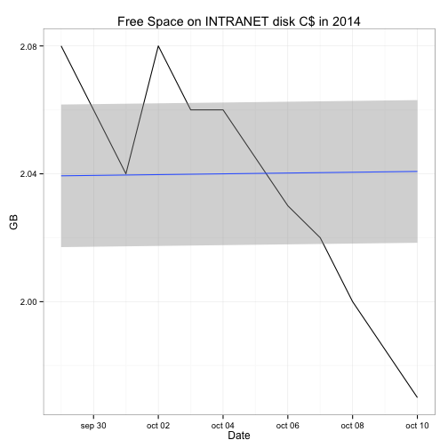

## The problem and solution

* I'm responsible of many servers of a company. I'm fear about getting low space on disks.  
* In Sep-2011 I made a python script that checks every fex minutes free space on disks on each server of my lan and logs in a file once a day the result.   
* If a disk gets 1GB low, the script sends me a email.  

**Now I want to see the log-data I got along these years graphically**.


--- .class #id 

## The data

The log file has this structure

```r
datalog <- read.csv("libre_en_disco_log.csv", dec=",",head=TRUE,sep="\t")
head(datalog)
```

```
##          SERVIDOR DISCO      FECHA     HORA     GB
## 1            VWEB    C$ 2011-06-23 14:36:00  22.68
## 2 BU-CONCENTRADOR    C$ 2011-06-23 14:36:00 195.57
## 3          S_BBDD    C$ 2011-06-23 14:36:00  34.22
## 4          S_BBDD    D$ 2011-06-23 14:36:00   1.36
## 5          S_BBDD    E$ 2011-06-23 14:36:00 386.09
## 6            S_TS    C$ 2011-06-23 14:36:00 125.49
```

--- .class #id

## The ShinyApp


* I made this shinyapp  

https://juliobm.shinyapps.io/projectfreespace

* You can choose server and the the page shows you only the disks that has the server.

* You can select a range date to show the data too.

* In another tab you can see the log file in table format.

* You can see the code at this link

https://github.com/juliobm/freespace


--- .class #id

## A graph example

 
